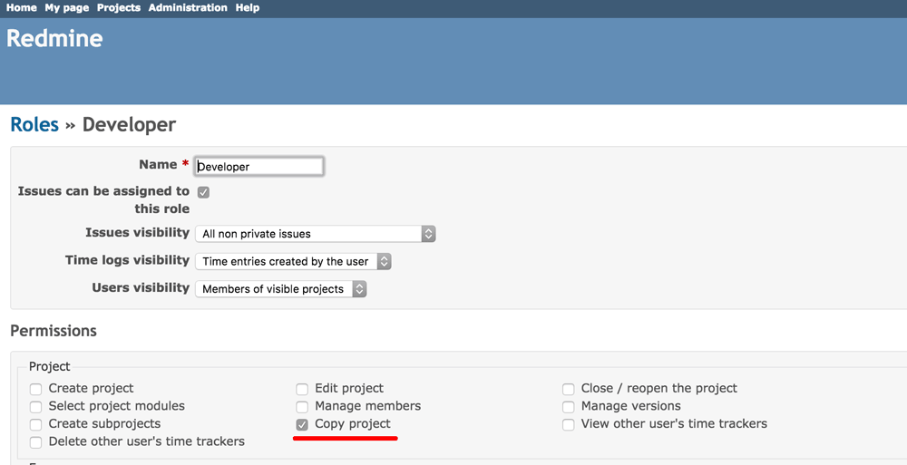
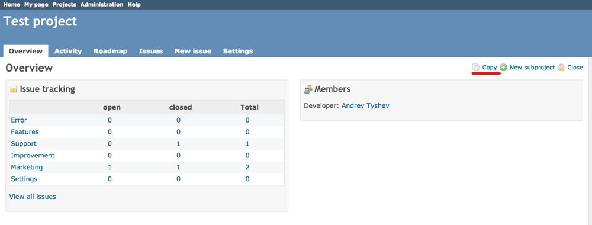

# Redmine Copy Project Plugin

Redmine plugin for adding project copy functionality into menu of the overview project page for all users who have special role.

It powered by standard functionality copying, but without the need to be an administrator.

## Install

1. Follow the [Redmine plugin installation](http://www.redmine.org/wiki/redmine/Plugins) steps. Make sure the plugin is installed to `plugins/redmine_copy_project`:
  * git clone https://github.com/SlowProg/redmine_copy_project.git
2. Restart Redmine.

Now you should be able to see the plugin in **Administration > Plugins**.

## Uninstall

1. Delete folder `<redmine_root>/plugins/redmine_copy_project`
2. Restart Redmine.
